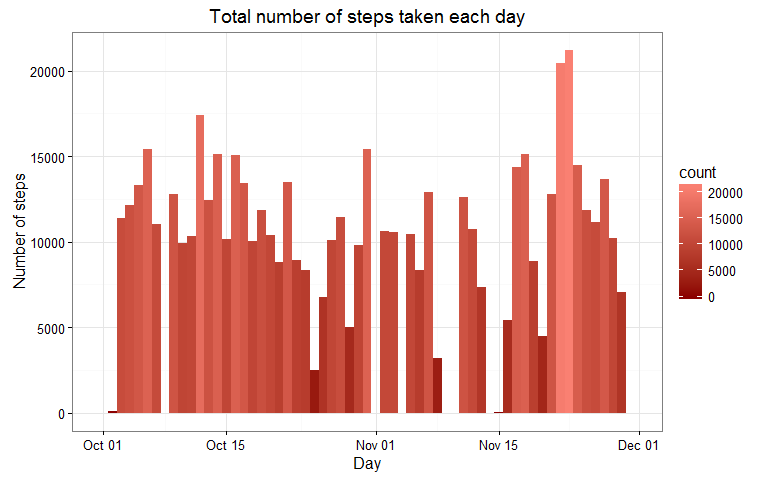
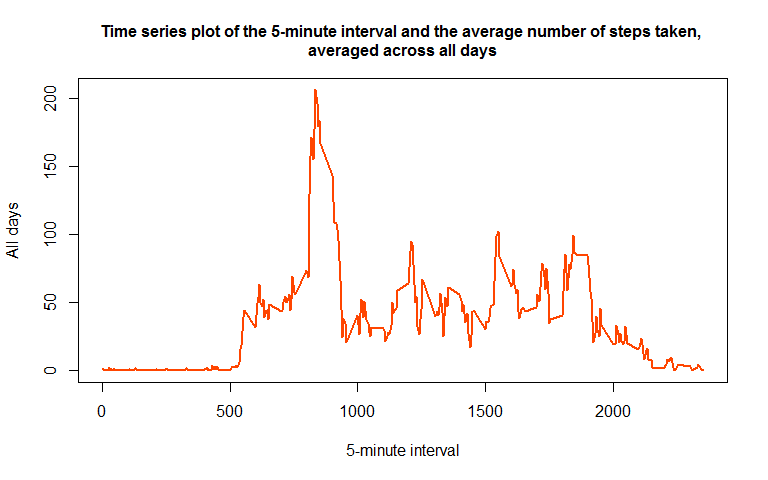
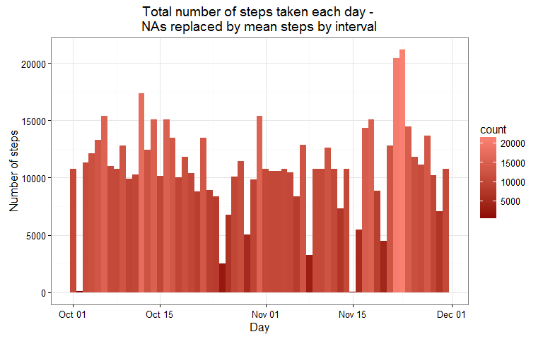
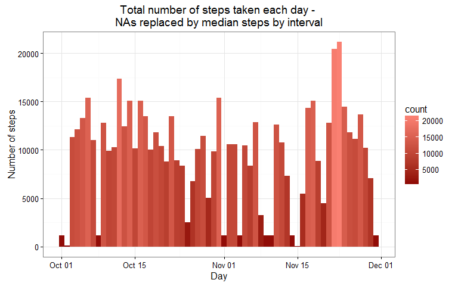
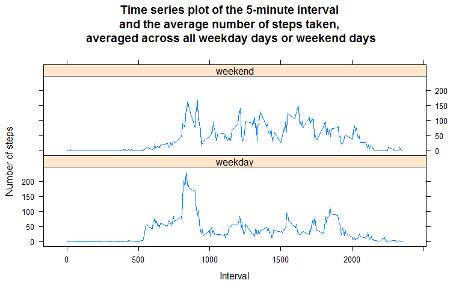

# Reproducible Research: Peer Assessment 1


## Loading and preprocessing the data

>#### Show any code that is needed to 
>#### 1. Load the data (i.e. read.csv())
>#### 2. Process/transform the data (if necessary) into a format suitable for your analysis

First of all, I set the work directory where I stored the data forked from GitHub repo: __rdpeng/RepData_PeerAssessment1__. Then I load the packages I am going to use for this assignment.


```r
library(dplyr)
library(ggplot2)
library(lattice)
library(grDevices)
library(knitr)
if(!file.exists("./figure")){dir.create("./figure")}
```

Then I set the directory where to save any plots in HTML-format.


```r
opts_chunk$set(fig.width=8, fig.height=5, fig.path="figure/figure-PNG/")
```

The data is stored in a zipped file, so I check its content, list, and unzip it.


```r
unzip("./activity.zip", list = TRUE, unzip = "internal")
unzip("./activity.zip", files = NULL, list = FALSE, overwrite = TRUE, junkpaths = FALSE, unzip = "internal", setTimes = FALSE)
```

Once data is unzipped, I use _read.csv2_ function to load the data in R environment. In particular, I set the arguments of this function on the basis of dataset's characteristics. 
As the ReadMe file states, dataset is stored in a comma-separated-value (CSV) file. The first row of the file contains variable names, whereas the second variable refers to the date on which the measurement was taken in YYYY-MM-DD date format. I assign loaded data to an object called __activity__ and check its structure that confirms there are a total of 17,568 observations of three variables: __steps__, __date__, and __interval__.


```r
activity <- read.csv2("./activity.csv", sep = ",", na.strings = "NA", header = TRUE, colClasses = c(NA,"Date",NA))
str(activity)
```

```
## 'data.frame':	17568 obs. of  3 variables:
##  $ steps   : int  NA NA NA NA NA NA NA NA NA NA ...
##  $ date    : Date, format: "2012-10-01" "2012-10-01" ...
##  $ interval: int  0 5 10 15 20 25 30 35 40 45 ...
```

Before answering the second point of the first question, I set my System Locale on English United States. This change allows to use time and date labels readable for english readers (I am Italian, and my System Locale is set on italian language).


```r
Sys.setlocale(category="LC_TIME", locale="English_United States.1252")
```

```
## [1] "English_United States.1252"
```


## What is mean total number of steps taken per day?
>#### 1. Make a histogram of the total number of steps taken each day
>######_For this part of the assignment, you can ignore the missing values in the dataset._

Using pipe coding provided by __dplyr__ package, I group and summarise 
data in order to create a data frame containing two variables: days, 
and the total number of steps taken each day.


```r
StepsByDay <- activity %>% group_by(date) %>% summarise (steps=sum
(steps))
str(StepsByDay)
```

```
## Classes 'tbl_df', 'tbl' and 'data.frame':	61 obs. of  2 variables:
##  $ date : Date, format: "2012-10-01" "2012-10-02" ...
##  $ steps: int  NA 126 11352 12116 13294 15420 11015 NA 12811 9900 ...
```

I use _qplot_ function of __ggplot2__ to make the histogram of total number of steps taken each day. I set _fill_ argument to emphasize days with the highest amount of steps: they are the brightest ones in the plot.


```r
par(mar=c(5,4,1,1),las=1)
qplot(date, data=StepsByDay,weight=steps,geom="histogram",binwidth=1,fill=..count..,main="Total number of steps taken each day", xlab = "Day", ylab = "Number of steps") + theme_bw() + scale_fill_gradient(low="red4",high = "salmon")
```



>#### 2. What is mean total number of steps taken per day?

Using _summary_ function I calculate the summary statistics of __steps__ variable. 
Then I assign Mean and Median to the objects called:__StepsMean__, and __StepsMedian__.


```r
options(scipen=1,digits=7)
StepsStatistics<-summary(StepsByDay$steps)
StepsMean<-StepsStatistics["Mean"]
StepsMedian<-StepsStatistics["Median"]
```

The mean total number of steps taken per day is __10770__, and the median is __10760__.


## What is the average daily activity pattern?

>#### 1. Make a time series plot (i.e. type = "l") of the 5-minute interval (x-axis) and the average number of steps taken, averaged across all days (y-axis)

To answer the question, I create the data frame called __StepsByAllDays__. 
I omit __NAs__, then I group by 5-minute interval, and calculate the average number of steps taken across all days.


```r
activityNAremoved<-na.omit(activity)
StepsByAllDays <- activityNAremoved %>% group_by(interval) %>% summarise (AverageSteps=mean(steps))
```

Then I realize the time series plot, and save it as requested.


```r
plot(StepsByAllDays$interval, StepsByAllDays$AverageSteps, type="l", main="Time series plot of the 5-minute interval and the average number of steps taken, \naveraged across all days", xlab= "5-minute interval", ylab= "All days", col="orangered" , lwd=2, cex.main=1)
```



>#### 2. Which 5-minute interval, on average across all the days in the dataset, contains the maximum number of steps?

Using _filter_ function of __dplyr__, I detect the row which contains the maximum number of steps to assign the relative __interval__ value to an object called __IntervalStepsMax__.


```r
options(scipen=1,digits=7) # to avoid scientific notation of big numbers
StepsMax<-filter(StepsByAllDays,AverageSteps==max(AverageSteps))
IntervalStepsMax<-StepsMax["interval"]
```

On average, across all the days in the dataset, the 5-minute interval contains the maximum number of steps is __835__.


## Imputing missing values

>#### 1. Calculate and report the total number of missing values in the dataset (i.e. the total number of rows with NAs)

To calculate the total number of missing values I use _sum_ function with _is.na_ function on the original dataset, and assign the result to an object called __TotalNumberNA__.


```r
TotalNumberNA<-sum(is.na(activity))
```

The total number of missing values is __2304__.

>#### 2. Devise a strategy for filling in all of the missing values in the dataset. The strategy does not need to be sophisticated. For example, you could use the mean/median for that day, or the mean for that 5-minute interval, etc.

To answer this question, I create a new data frame summarising data by interval. 
In particular, I use mean and median of steps across all days by interval.


```r
StatIntSteps<-activity %>% group_by(interval) %>% summarise (MeanIntSteps=mean(steps,na.rm=T),MedianIntSteps=median(steps,na.rm=T))
```

>#### 3. Create a new dataset that is equal to the original dataset but with the missing data filled in.

To make a more in-depth comparison, I create two new datasets, both of them are equal to the orginal: the first one, named __activity2__, the missing data are replaced by mean values calculated by interval across all days; in the second one, named __activity3__, missing data are replaced by median values calculated by interval across all days.


```r
activity2<-activity %>% group_by(interval) %>% mutate(steps=ifelse(is.na(steps), mean(steps, na.rm=TRUE), steps))
activity3<-activity %>% group_by(interval) %>% mutate(steps=ifelse(is.na(steps), median(steps, na.rm=TRUE), steps))
```

I decided to create two datasets instead of only one, to compare the impact of using different values on summary statistics of the total daily number of steps.

>#### 4. Make a histogram of the total number of steps taken each day and Calculate and report the mean and median total number of steps taken per day. Do these values differ from the estimates from the first part of the assignment? What is the impact of imputing missing data on the estimates of the total daily number of steps?

As previously done, I create two data frames called __StepsByDayNArepMean__, and __StepsByDayNArepMedian__. The first one, refers to missing data replaced by mean values grouped by interval; the second one, to missing data replaced by median values of steps taken across all days by interval.


```r
StepsByDayNArepMean <- activity2 %>% group_by(date) %>% summarise (steps=sum(steps))
StepsByDayNArepMedian <- activity3 %>% group_by(date) %>% summarise (steps=sum(steps))
```

In order to answer the main question of this point I make the histograms referred to each datasets, and saved the plots as requested.
The first histogram with missing values replaced by means.


```r
par(mfrow=c(1,2),mar=c(4,4,2,1),oma=c(0,0,2,0))
par(mar=c(5,4,1,1),las=1)
qplot(date, data=StepsByDayNArepMean, weight=steps, geom="histogram", binwidth=1, fill=..count.., main = "Total number of steps taken each day - \nNAs replaced by mean steps by interval", xlab = "Day", ylab = "Number of steps") + theme_bw() + scale_fill_gradient(low="red4",high = "salmon")
```



The second one with missing values replaced by medians.


```r
par(mar=c(5,4,1,1),las=1)
qplot(date, data=StepsByDayNArepMedian, weight=steps, geom="histogram", binwidth=1, fill=..count.., main = "Total number of steps taken each day - \nNAs replaced by median steps by interval", xlab = "Day", ylab = "Number of steps") + theme_bw() + scale_fill_gradient(low="red4",high = "salmon")
```



Using _summary_ function I calculate the summary statistics of __steps__ variable. Then I assign Median and Mean to the objects called: __StepsMedian__ and __StepsMean__.


```r
options(scipen=1,digits=7)
StepsStatisticsNArepMean<-summary(StepsByDayNArepMean$steps)
StepsMeanNArepMean<-StepsStatisticsNArepMean["Mean"]
StepsMedianNArepMean<-StepsStatisticsNArepMean["Median"]
StepsStatisticsNArepMedian<-summary(StepsByDayNArepMedian$steps)
StepsMeanNArepMedian<-StepsStatisticsNArepMedian["Mean"]
StepsMedianNArepMedian<-StepsStatisticsNArepMedian["Median"]
```

The following table shows the different impact made by mean and median in replacing missing values.

Summary statistics: total daily number of steps|Mean|Median|
-----------------------------------------------|----|------|
NAs omitted |__10770__|__10760__|
NAs replaced with mean by interval|__10770__|__10770__|
NAs replaced with median by interval|__9504__|__10400__|

As you can see, using median - that is a more robust measure than mean - the total daily number of steps seems to be underestimated in comparison with estimated values using mean to replace NAs.


## Are there differences in activity patterns between weekdays and weekends?

According to the standard definition used in the United States, the working week begins on Monday and ends on Friday, with Saturday and Sunday being weekend days.
Using _weekdays_ function, I compute a new factor variable (named __typeofday__) in the __activity2__ dataset with two levels "weekday" and "weekend" indicating whether a given date is a weekday or weekend day.


```r
activity2$weekdays<-weekdays(activity3$date)
weekend <- activity2$weekdays %in% c("Saturday","Sunday")
weekday <- activity2$weekdays %in% c("Monday","Tuesday","Wednesday","Thursday","Friday")
activity2$typeofday[weekend] <- "weekend"
activity2$typeofday[weekday] <- "weekday"
as.factor(activity2$typeofday)
```

Finally, I have to create a new dataset to make a panel plot containing a time series plot of the 5-minute interval (x-axis) and the average number of steps taken, averaged across all weekday days or weekend days (y-axis).


```r
stepsBy5minDayNArepMean <- aggregate(steps ~ interval + typeofday, data = activity2, mean)
names(stepsBy5minDayNArepMean) <- c("interval", "typeofday", "steps")
```

The panel plot is realized using _xyplot_ function of __lattice__ package.
The following plot shows how the monitored subject has different behaviors between weekend and weekday. It seems to be used to walk more during the weekends.


```r
library(lattice)
xyplot(steps ~ interval | typeofday, stepsBy5minDayNArepMean, type = "l", layout = c(1, 2), 
       xlab = "Interval", ylab = "Number of steps", main="Time series plot of the 5-minute interval \nand the average number of steps taken, \naveraged across all weekday days or weekend days")
```



__Post Scriptum (to all cheaters' hunters)__: _I have done this assignment last year in August 2015, although I never finished the Reproducible Research Course._ 
